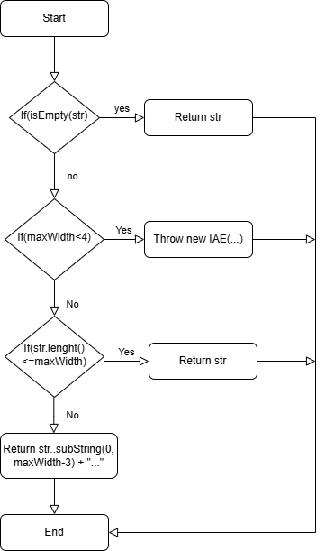

White Box Testing - Control Flow Testing
===================

O método `StringUtils.abbreviate(String str, int maxWidth)` foi escolhido para a secção de White Box Testing porque apresenta um bom equilíbrio entre simplicidade e complexidade lógica, tornando-se adequado para aplicar técnicas de testes baseadas em controlo de fluxo e fluxo de dados.

```
public static String abbreviate(final String str, final int maxWidth) {
    if (isEmpty(str))        return str;           // Decisão 1
    if (maxWidth < 4)        throw new IAE(...);   // Decisão 2
    if (str.length() <= maxWidth)  return str;     // Decisão 3
    return str.substring(0, maxWidth - 3) + "..."; // Trunca
}
```

Este método tem como objetivo abreviar uma string para um comprimento máximo especificado, adicionando reticências ("...") se a string original for mais longa do que o limite.

Apesar de ser um método relativamente pequeno, contém várias características importantes que o tornam interessante para análise white-box:
1. Multiplas condições (if)
2. Diferentes caminhos de execução dependendo dos inputs
3. Tratamento de exceções
4. Comportamentos relacionados com valores limite
5. Chamadas internas que influenciam o resultado final
6. Dependências entra variáveis e condições

Estas características permitem aplicar várias das técnicas exigidas no projeto, incluindo:

- Statement / Node Coverage
- Decision Coverage
- Condition Coverage
- Modified Condition/Decision Coverage (MC/DC)
- Independent Path Coverage

Obtendo o seguinte diagrama de controlo de fluxo:



